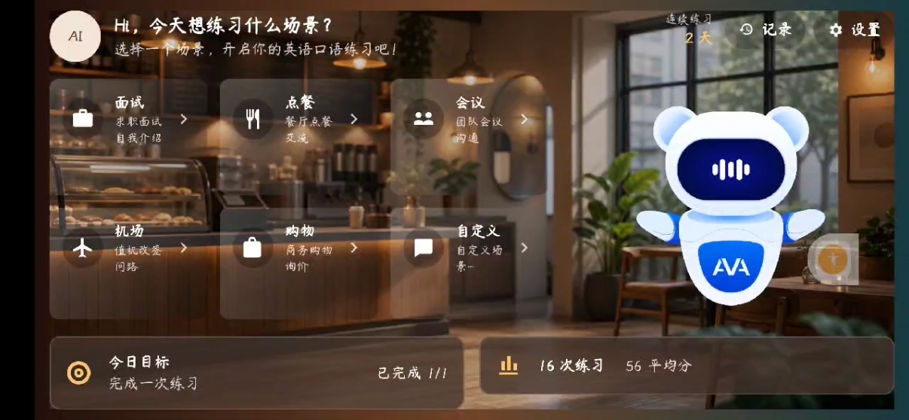
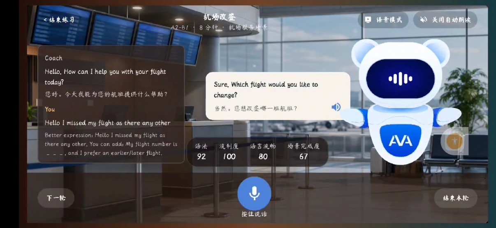
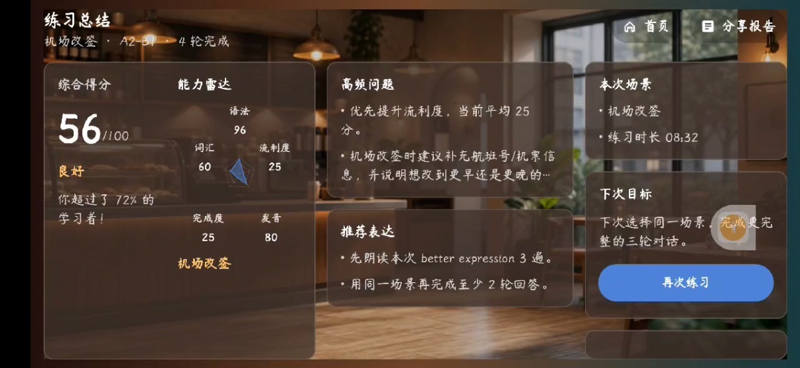
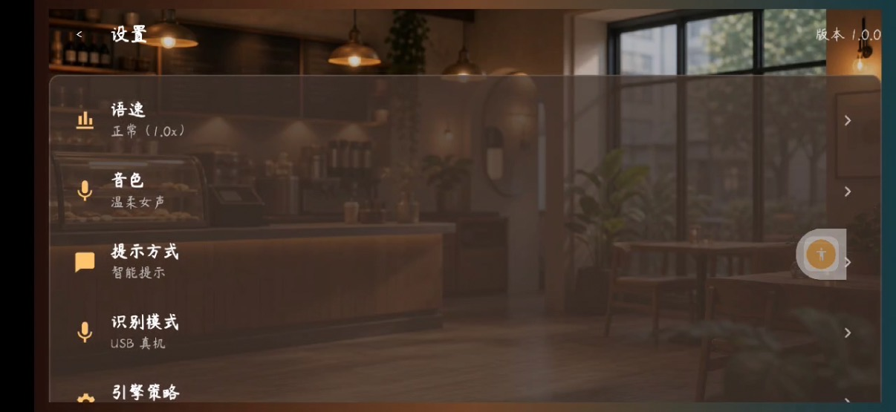
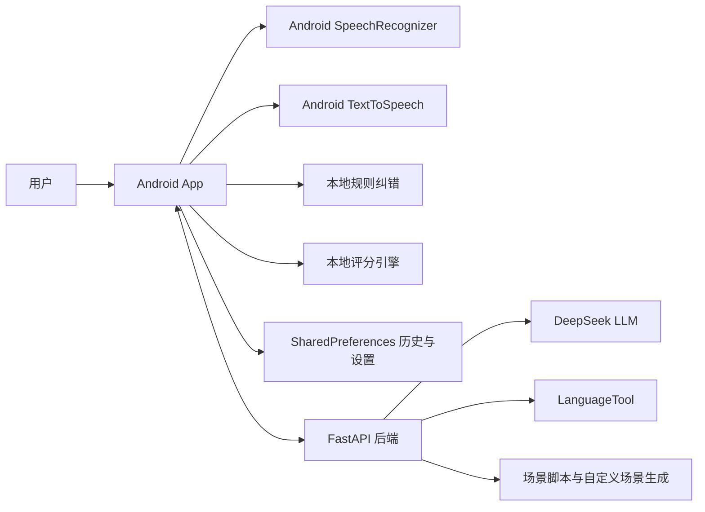

# AI 英语口语陪练工具

面向真实生活和工作场景的 Android 英语口语陪练 Demo。用户可以选择或生成练习场景，通过语音或演示输入完成多轮英文对话，并获得转写、纠错、评分、AI 教练回复、TTS 朗读、课后总结和历史回顾。

项目目标是做出一个稳定可演示的主链路：**选择场景 -> 开口表达 -> 获得反馈 -> 查看总结 -> 继续提升**。当前版本已完成 Android 客户端和 FastAPI 后端的可运行闭环，后端不可用时仍可通过本地规则完成演示。

## 参赛与提交信息

- 活动批次：2026 年 6 月 5 日 00:00 - 2026 年 6 月 7 日 23:59
- 参赛题目：题目一：AI 英语口语陪练
- 作品形态：Android App + FastAPI 增强后端
- 当前阶段：可运行 Demo 闭环
- 仓库要求：提交公开 GitHub / Gitee 仓库，README、Demo 视频和依赖说明需完整可访问
- Demo 视频：[视频链接](https://pan.quark.cn/s/42b4a22e05aa)

Demo 视频覆盖：首页场景入口、自定义场景生成、语音识别或演示输入、云端教练分析、本地 fallback、TTS 朗读、评分纠错、课后总结、历史记录和设置页多引擎切换。

Demo 部分截图展示：





## 作品亮点

- **完整口语练习闭环**：从场景选择、对话推进、语音输入、纠错评分到课后总结和历史回顾，覆盖一次真实练习所需的主要步骤。
- **稳定演示优先**：云端 FastAPI / LanguageTool 可增强反馈；网络、后端或第三方服务不可用时，Android 端自动使用本地规则 fallback。
- **场景化反馈**：不仅纠正常见语法错误，还会结合点餐、面试、会议、机场、购物、医院、图书馆等场景给出更具体的表达建议。
- **可解释评分**：语法、流利度、发音清晰度、场景完成度均有分数和原因，课后总结会扩展为能力雷达和下一步目标。
- **多引擎切换设计**：设置页提供稳定演示、效果优先、离线优先三种策略，明确展示当前 ASR、TTS、判定链路及预留能力。
- **持续交付记录**：本地 git 历史可见从 2026-06-05 到 2026-06-07 持续拆分 PR / commit 开发，覆盖文档、后端、Android 主链路、语音、历史、LanguageTool、多引擎和自定义场景等模块。

## 已实现功能

### 1. 首页与场景入口

- 首页提供点餐、面试、会议、机场、购物、自定义场景等快捷入口。
- 预置场景包含餐厅点餐、面试练习、会议讨论。
- 机场、购物等快捷入口会通过自定义场景工厂即时生成练习脚本。
- 场景列表支持输入自定义 prompt，例如“机场改签”“健身房办卡”“图书馆借书”，生成对应角色、目标、关键词、开场白和多轮对话。
- 场景详情页展示角色、等级、训练目标、关键词和对话节奏。

### 2. 横屏沉浸练习

- Android App 固定横屏，使用场景舞台展示背景、角色、对话气泡、底部操作栏和实时评分。
- 已内置餐厅、机场、办公室、会议、购物等背景图；未知自定义场景会使用 Canvas 生成简化背景。
- Lottie 角色根据练习状态切换 idle、listening、thinking、speaking 等状态。
- 练习页显示当前状态、对话历史、用户转写、推荐表达、AI 教练回复和中文辅助翻译。

### 3. 语音输入与 TTS

- 使用 Android `SpeechRecognizer` 进行语音识别，支持权限申请、partial transcript、final transcript 和错误恢复。
- 设备不支持识别、权限未授予或识别失败时，可切换演示输入，保证现场演示不中断。
- 使用 Android `TextToSpeech` 朗读教练开场白和回复。
- 练习页支持开启/关闭朗读，并展示当前语音输入模式。

### 4. 云端教练与本地 fallback

- Android 端默认请求 FastAPI `/coach/analyze` 获取教练回复、纠错建议、评分和反馈来源。
- 后端配置 `DEEPSEEK_API_KEY` 后，`/coach/analyze` 会优先调用 DeepSeek 大模型生成更自然的教练回复、中文翻译、推荐表达和学习建议，并返回 `source=DEEPSEEK`。
- 未配置 DeepSeek、DeepSeek 超时或响应异常时，接口不中断，自动回退到现有规则纠错、场景脚本回复和评分链路。
- 后端不可用、请求超时或外部服务失败时，客户端自动回落到本地 `RuleCorrectionEngine`、`ScoreEngine` 和脚本回复。
- 设置页支持三类后端地址：
  - `USB 真机`：`http://127.0.0.1:8000`，配合 `adb reverse`。
  - `Android 模拟器`：`http://10.0.2.2:8000`。
  - `自定义地址`：用于局域网 IP 或 Cloudflare Tunnel。

### 5. 纠错与场景化建议

- 本地规则可处理 `I want order`、`I has`、`I am agree`、`I want go` 等常见错误。
- 点餐场景会提示补充 `please` 等礼貌表达。
- 后端默认接入 LanguageTool 公共接口，也支持通过 `LANGUAGETOOL_URL` 指向本地或自建服务。
- LanguageTool 成功时返回 `LANGUAGE_TOOL` 来源；超时或异常时返回 `RULE_FALLBACK`，接口不中断。
- 后端已加入场景化指导：
  - 面试：提示使用 STAR 结构。
  - 会议：提示补充 risk、owner、next step 等信息。
  - 机场：提示补充航班号、票号或改签时间。
  - 购物、医院、图书馆、自定义场景：根据关键词补充对应表达建议。

### 6. 评分与课后总结

- 每轮练习返回四维评分：
  - 语法：根据纠错数量计算。
  - 流利度：根据词数和时长估算语速。
  - 发音清晰度：基于 ASR 置信度。
  - 场景完成度：根据命中的场景目标计算。
- 课后总结包含轮次、平均分、优势、待提升项、下一次目标、练习计划和每轮回顾。
- 总结页通过能力雷达展示语法、流利度、发音、完成度、词汇等维度。

### 7. 历史记录与持久化

- 完成练习后会记录场景、完成时间、轮次、平均分、优势、改进点、下一步目标和能力拆分。
- 历史页支持查看最近记录、回顾单次练习结果、清空记录。
- 首页会读取本地历史，展示今日完成情况、累计 turn 数和最近一次总结。
- 设置页的连接方式、自定义后端地址和引擎策略会通过 SharedPreferences 持久化保存，App 重启后继续生效。

## 技术架构



### Android 客户端

- 语言与框架：Kotlin、Jetpack Compose、Material 3
- 系统能力：Android SpeechRecognizer、Android TextToSpeech、SharedPreferences
- 动画与视觉：Lottie Compose、场景背景图、Compose Canvas fallback
- 主要模块：
  - `ScenarioCatalog`：预置场景目录。
  - `CustomScenarioFactory`：根据用户 prompt 生成场景脚本。
  - `PracticeSession`：管理练习轮次、对话推进和总结。
  - `RuleCorrectionEngine`：本地规则纠错。
  - `ScoreEngine`：四维评分。
  - `CoachApiClient`：请求后端 `/coach/analyze`。
  - `SpeechRecognizerAdapter` / `TextToSpeechAdapter`：封装语音能力。
  - `PracticeHistoryStore` / `AppSettingsStore`：本地持久化。
  - `HomeScreen`、`ScenarioListScreen`、`ScenarioDetailScreen`、`PracticeScreen`、`HistoryScreen`、`CoachSettingsScreen`：核心页面。

### FastAPI 后端

- 语言与框架：Python 3.11+、FastAPI、Pydantic、httpx
- 已实现接口：
  - `GET /health`：健康检查。
  - `GET /scenarios`：返回后端可识别场景。
  - `POST /grammar/check`：规则 + LanguageTool 纠错。
  - `POST /coach/analyze`：返回教练回复、推荐表达、tips、四维评分和来源。
  - `POST /summary`：根据练习 turn 生成基础总结。
- 稳定性设计：
  - DeepSeek 请求只读取环境变量中的 API Key，不在仓库保存密钥。
  - DeepSeek 请求设置超时，失败后自动回退到规则链路。
  - LanguageTool 请求设置超时。
  - 外部服务失败不影响接口主流程。
  - 自定义场景 ID 可在没有 JSON 文件时按规则生成。
  - 后端无数据库依赖，便于本地和演示部署。

## 依赖与原创范围说明

第三方依赖均已在工程文件中声明：

- Android 依赖见 [android/build.gradle.kts](android/build.gradle.kts)
  - Android Gradle Plugin
  - Kotlin Android / Compose 插件
  - Jetpack Compose BOM、Material 3、Activity Compose、Lifecycle ViewModel Compose
  - Lottie Compose
  - JUnit
- 后端依赖见 [backend/requirements.txt](backend/requirements.txt)
  - FastAPI
  - Pydantic
  - httpx
  - pytest
  - uvicorn

本作品原创实现部分包括：Android 端页面与交互、场景脚本结构、自定义场景生成规则、练习状态机、本地纠错规则、评分公式、课后总结、历史记录、后端 API 编排、LanguageTool fallback 逻辑和测试用例。第三方库主要用于基础框架、语音系统能力接入、动画渲染、HTTP 服务和测试。

## 本地运行与验证

### 1. 启动后端

```bash
cd backend
python3 -m venv .venv
. .venv/bin/activate
pip install -r requirements.txt
PYTHONPATH=. uvicorn app.main:app --host 127.0.0.1 --port 8000 --reload
```

如需启用 DeepSeek 大模型教练，在启动后端前配置：

```bash
export DEEPSEEK_API_KEY="<your-deepseek-api-key>"
export DEEPSEEK_MODEL=deepseek-v4-flash
export DEEPSEEK_TIMEOUT_SECONDS=8.0
```

`DEEPSEEK_BASE_URL` 默认是 `https://api.deepseek.com`。DeepSeek 调用成功时返回 `source=DEEPSEEK`；未配置 key、请求超时或响应格式异常时，会自动使用规则链路，保证 Demo 不被第三方服务状态阻断。

如需自建 LanguageTool：

```bash
export LANGUAGETOOL_URL=http://127.0.0.1:8081/v2/check
export LANGUAGETOOL_TIMEOUT_SECONDS=4.0
```

未配置 `LANGUAGETOOL_URL` 时，后端默认使用 `https://api.languagetool.org/v2/check`，练习文本会发送到该第三方服务。若演示环境不允许外发文本，请配置本地 LanguageTool 或关闭后端增强，客户端仍可使用本地规则 fallback。

### 2. Android 真机联调

```bash
adb reverse tcp:8000 tcp:8000
```

安装 Debug APK 后，进入 App 设置页，选择 `USB 真机`。练习页生成反馈后若显示云端或 LanguageTool 来源，说明真机到 FastAPI 的闭环已接通。

局域网或 Cloudflare Tunnel 演示时，在设置页选择自定义地址并填写后端可访问 URL。Cloudflare Tunnel 适合把本机 FastAPI 暴露给手机或评委设备临时访问。

### 3. 后端测试

```bash
cd backend
PYTHONPATH=. .venv/bin/python -m pytest tests -q
```

### 4. Android 单元测试

```bash
ANDROID_HOME=/path/to/android/sdk ./gradlew :android:testDebugUnitTest
```

### 5. Android Debug 包

```bash
ANDROID_HOME=/path/to/android/sdk ./gradlew :android:assembleDebug
```

Debug APK 输出位置：

```text
android/build/outputs/apk/debug/android-debug.apk
```

## Demo 操作路径

1. 打开 App，进入首页。
2. 点击点餐、面试、会议等预置场景，或点击机场/购物/自定义生成新场景。
3. 查看场景详情，确认角色、目标、关键词和难度。
4. 进入横屏练习页，点击语音输入或使用演示输入。
5. 提交后查看 ASR 转写、推荐表达、纠错提示、AI 回复、中文辅助翻译和评分。
6. 听取 TTS 朗读，继续下一轮对话。
7. 点击完成，查看课后总结、能力雷达、每轮回顾和下一步目标。
8. 回到历史页，查看最近练习记录和单次回顾。
9. 进入设置页，切换 USB 真机、模拟器、自定义地址和稳定演示/效果优先/离线优先策略。

## 开发过程与质量说明

本项目按功能拆分分支和 PR，主分支合并后保持可运行。根据本地 git 历史，核心提交时间落在活动批次内，且覆盖多个日期与多个独立功能点。

可见 PR / 分支合并示例：

- `#1 docs/design-foundation`：初始化需求、架构和设计文档。
- `#2 feat/backend-core`：实现规则型后端 API。
- `#3 feat/android-practice-loop`：建立 Android 练习主循环。
- `#4 feat/android-home-navigation`：实现首页导航和主题。
- `#5 feat/android-scenarios`：实现本地场景列表与详情。
- `#6 feat/android-practice-ui-states`：完善练习页状态。
- `#7 feat/android-summary-history`：实现总结和历史基础流程。
- `#8 feat/android-speech-tts`：接入 SpeechRecognizer 与 TextToSpeech。
- `#9 feat/android-backend-fallback`：接入云端教练和本地 fallback。
- `#13 feat/languagetool-correction-loop`：完成 LanguageTool 纠错闭环。
- `#17 feat/engine-selection-contracts`：新增多引擎策略模型。
- `#19 fix/backend-cloud-scenarios-languagetool`：扩展云端场景与 LanguageTool 指导。
- `#20 fix/android-scenarios-history-custom-ui`：对齐 Android 场景、历史和自定义练习 UI。
- `#21 fix/custom-scene-photo-generation`：改进自定义场景视觉与生成逻辑。

代码质量保障：

- Android 端核心领域逻辑有单元测试覆盖，包括场景目录、自定义场景、练习状态、评分、纠错、设置持久化、历史记录、语音状态和 UI 合约。
- 后端测试覆盖健康检查、教练分析、规则纠错、LanguageTool 成功/失败、场景生成、评分和总结。
- 主链路避免把演示成功完全绑定在外部服务上，后端不可用时仍能完成练习。
- 没有在仓库中硬编码密钥、令牌或真实用户语音数据。

## 仓库结构

```text
.
├── android/                 # Android 客户端
│   ├── src/main/java/       # Kotlin/Compose 源码
│   ├── src/main/res/        # 图标、背景图、Lottie 等资源
│   └── src/test/java/       # Android 单元测试
├── backend/                 # FastAPI 后端
│   ├── app/                 # API、schemas、services
│   ├── tests/               # 后端自动化测试
│   └── requirements.txt     # 后端 Python 依赖
├── docs/
│   ├── requirements.md      # 需求分析
│   ├── architecture.md      # 概要设计与系统架构
│   ├── detailed-design.md   # 详细设计与接口约定
│   ├── development-plan.md  # 开发计划
│   ├── uml.md               # UML/Mermaid 图
│   └── scenarios/           # 场景脚本示例
├── assets/design/           # 设计说明与素材入口
├── build.gradle.kts         # 根 Gradle 配置
├── settings.gradle.kts      # Gradle 模块配置
└── AGENTS.md                # AI 协作开发约束
```

## 文档入口

- [需求分析](docs/requirements.md)
- [概要设计](docs/architecture.md)
- [详细设计](docs/detailed-design.md)
- [开发计划](docs/development-plan.md)
- [UML 图](docs/uml.md)
- [点餐场景脚本示例](docs/scenarios/restaurant.json)
- [Android 客户端说明](android/README.md)
- [FastAPI 后端说明](backend/README.md)

## 未开发但有价值的展望功能

以下能力尚未作为当前主链路完成，后续可在现有架构上逐步接入：

- **专业发音评测**：接入音素级或单词级发音评测，给出重音、连读、音素错误和跟读建议，而不是仅用 ASR 置信度估算清晰度。
- **云端 ASR / PaddleSpeech**：在效果优先模式中接入更稳定的长句识别和噪声环境识别，当前 UI 与配置层已预留入口。
- **云端神经 TTS**：为不同场景角色提供更自然的音色、语速和情绪表达，当前已保留 TTS 引擎策略。
- **LLM 个性化教练**：根据用户历史表现生成更个性化的追问、纠错解释、替代表达和学习计划。
- **可视化场景编辑器**：把当前代码内的场景工厂扩展为可编辑后台，支持新增角色、目标、关键词、评分规则和对话轮次。
- **文生图场景背景缓存**：根据自定义场景生成更贴近内容的背景图，并做本地缓存和审核兜底。
- **账号与多端同步**：支持学习记录跨设备同步、长期趋势分析和阶段性学习报告。
- **更完整的隐私控制**：允许用户选择是否上传文本/语音到云端，并在本地优先模式下完全离线完成练习。

当前版本刻意优先保证可运行、可验证和可演示，避免把主流程依赖在尚未稳定接入的模型能力上。
