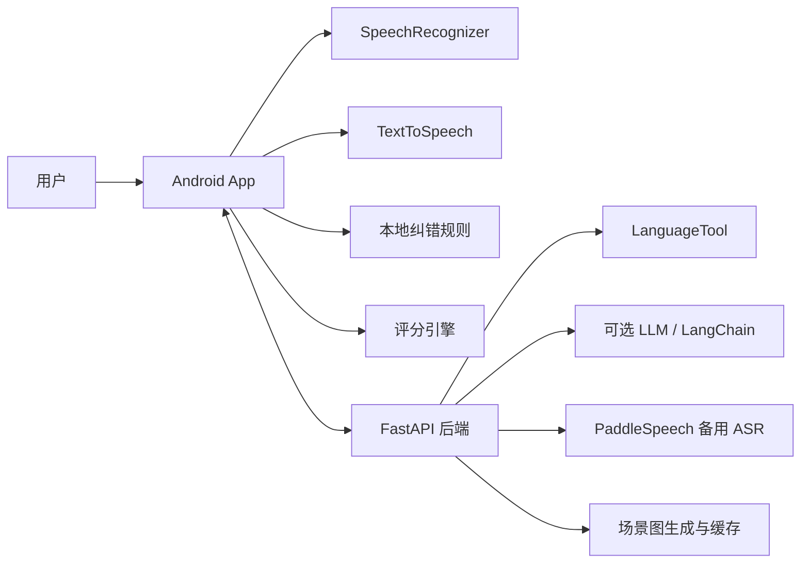
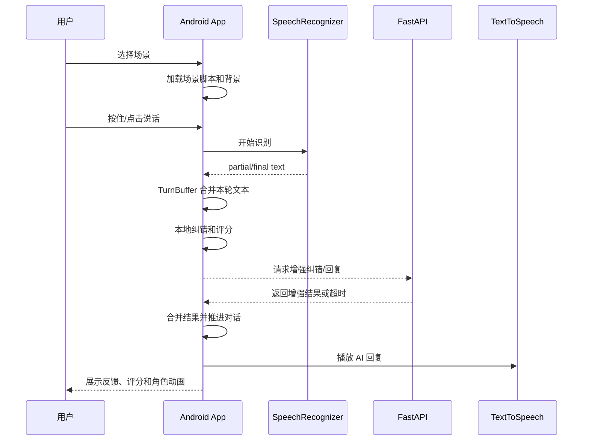
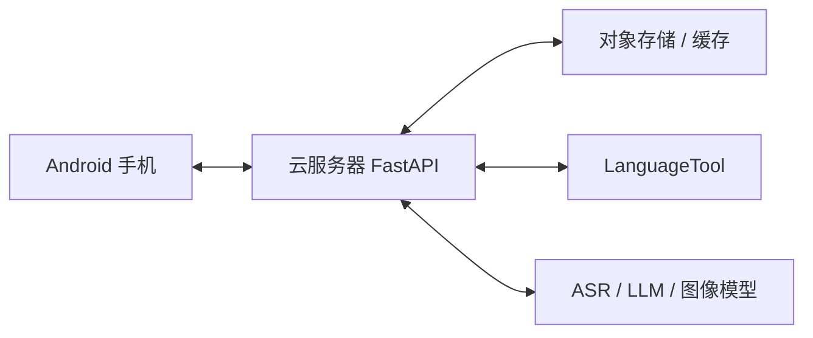

# 概要设计

## 总体架构

系统采用 Android 客户端 + FastAPI 后端 + 可选 AI 增强服务的结构。主链路尽量放在 Android 端完成，确保 Demo 稳定；后端提供语法增强、总结生成、备用 ASR 和场景资源生成等能力。

## Android 客户端

客户端负责用户交互和主流程编排：

- `ScenarioEngine`：加载场景脚本，维护当前对话目标和轮次。
- `TurnBuffer`：收集 partial text，合并长句，控制提交边界。
- `SpeechRecognizerAdapter`：封装 Android 语音识别。
- `TextToSpeechAdapter`：封装 TTS 播放和状态回调。
- `RuleCorrectionEngine`：执行本地规则纠错。
- `ScoreEngine`：计算多维评分。
- `PracticeViewModel`：协调识别、纠错、评分、回复和 UI 状态。
- `DemoFallbackRepository`：提供离线可演示数据。

## FastAPI 后端

后端作为增强服务，不阻塞主链路：

- `/grammar/check`：调用 LanguageTool，返回语法检查结果。
- `/coach/analyze`：生成表达建议和课后总结。
- `/image/generate`：生成或返回缓存场景图。
- `/asr/paddle`：备用语音识别接口。
- `/summary`：根据练习记录生成总结。

## 数据流

## 稳定性策略

- 主链路优先使用系统 ASR、TTS 和本地规则。
- 后端请求设置超时，失败后返回本地 fallback。
- 场景图、脚本和角色资源本地缓存。
- 评分公式可解释，避免依赖不可控模型输出。

## 部署方案

### 开发 / 演示部署

适合比赛演示和快速迭代，手机通过公网 HTTPS 访问本机后端。

### 正式部署

正式部署中，后端服务、缓存和模型服务可按模块扩展。

