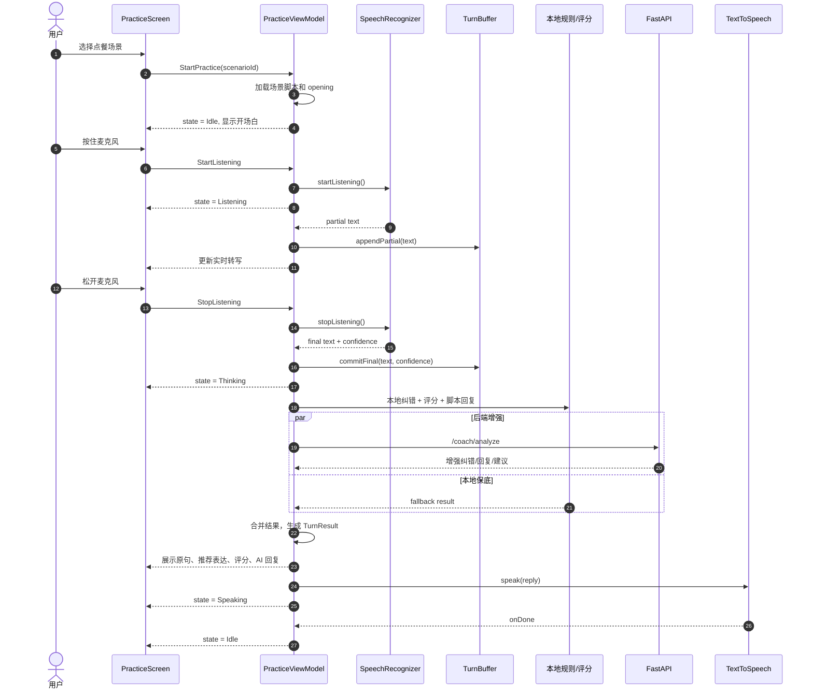
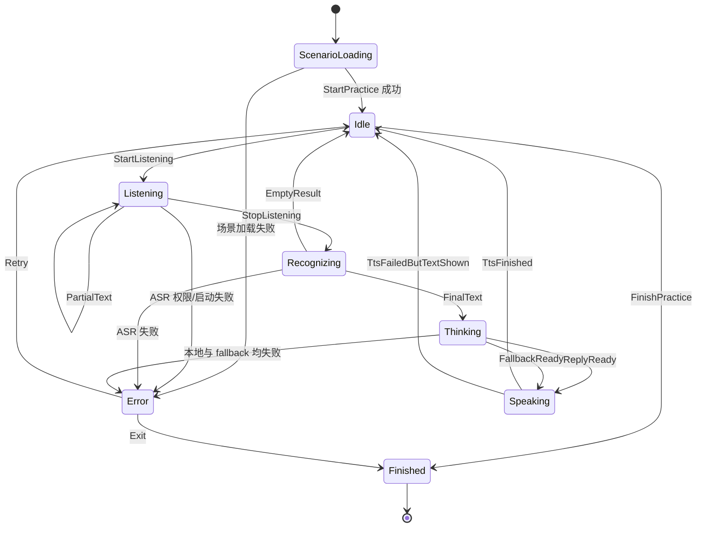
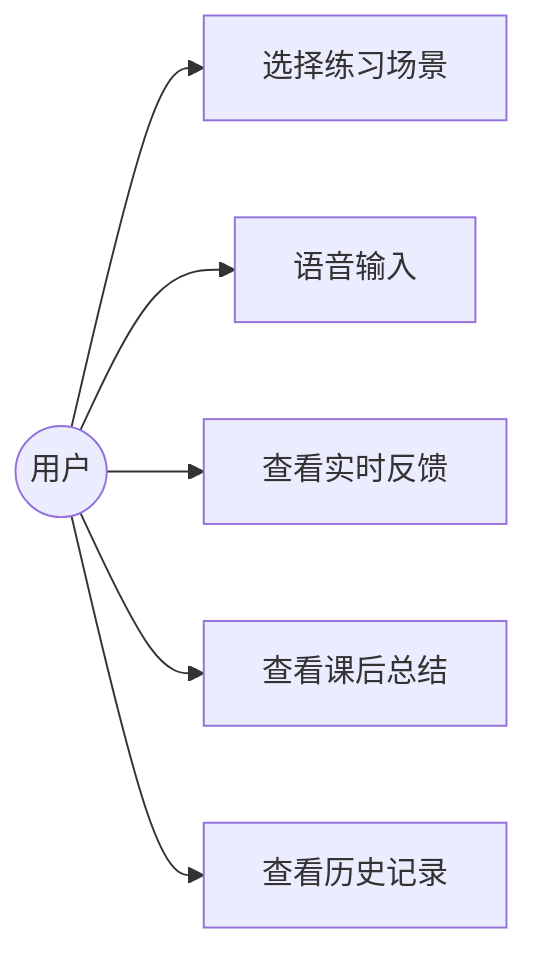
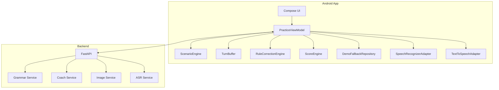
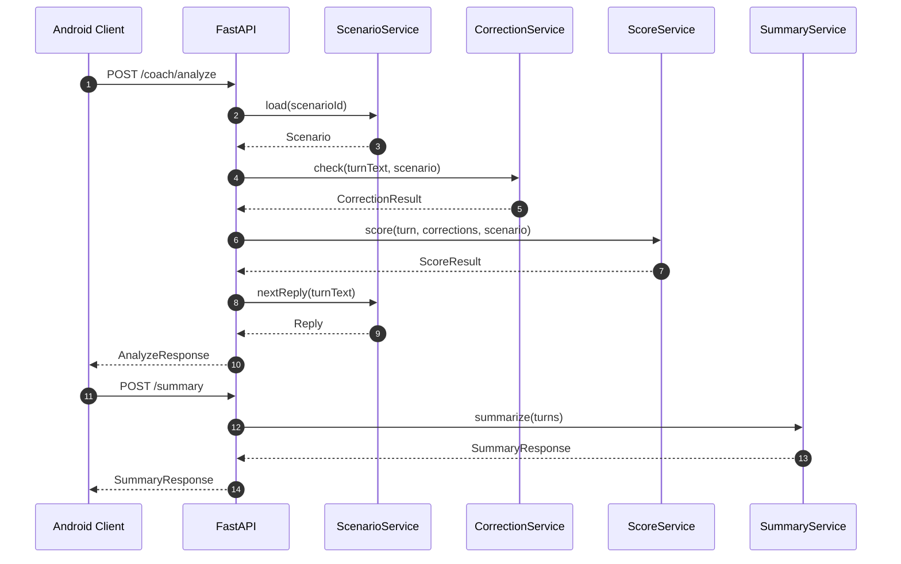
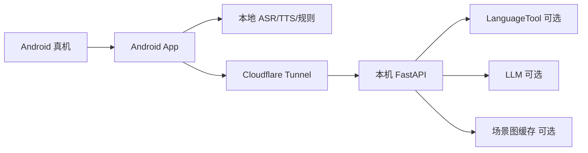

# UML 与流程图

## 练习主链路顺序图

```mermaid
sequenceDiagram
    autonumber
    actor User as 用户
    participant UI as PracticeScreen
    participant VM as PracticeViewModel
    participant ASR as SpeechRecognizer
    participant Turn as TurnBuffer
    participant Core as 本地规则/评分
    participant API as FastAPI
    participant TTS as TextToSpeech

    User->>UI: 选择点餐场景
    UI->>VM: StartPractice(scenarioId)
    VM->>VM: 加载场景脚本和 opening
    VM-->>UI: state = Idle, 显示开场白

    User->>UI: 按住麦克风
    UI->>VM: StartListening
    VM->>ASR: startListening()
    VM-->>UI: state = Listening
    ASR-->>VM: partial text
    VM->>Turn: appendPartial(text)
    VM-->>UI: 更新实时转写

    User->>UI: 松开麦克风
    UI->>VM: StopListening
    VM->>ASR: stopListening()
    ASR-->>VM: final text + confidence
    VM->>Turn: commitFinal(text, confidence)
    VM-->>UI: state = Thinking

    VM->>Core: 本地纠错 + 评分 + 脚本回复
    par 后端增强
        VM->>API: /coach/analyze
        API-->>VM: 增强纠错/回复/建议
    and 本地保底
        Core-->>VM: fallback result
    end
    VM->>VM: 合并结果，生成 TurnResult
    VM-->>UI: 展示原句、推荐表达、评分、AI 回复
    VM->>TTS: speak(reply)
    VM-->>UI: state = Speaking
    TTS-->>VM: onDone
    VM-->>UI: state = Idle
```

## 练习状态图

```mermaid
stateDiagram-v2
    [*] --> ScenarioLoading
    ScenarioLoading --> Idle: StartPractice 成功
    ScenarioLoading --> Error: 场景加载失败

    Idle --> Listening: StartListening
    Listening --> Listening: PartialText
    Listening --> Recognizing: StopListening
    Listening --> Error: ASR 权限/启动失败

    Recognizing --> Thinking: FinalText
    Recognizing --> Idle: EmptyResult
    Recognizing --> Error: ASR 失败

    Thinking --> Speaking: ReplyReady
    Thinking --> Speaking: FallbackReady
    Thinking --> Error: 本地与 fallback 均失败

    Speaking --> Idle: TtsFinished
    Speaking --> Idle: TtsFailedButTextShown

    Idle --> Finished: FinishPractice
    Error --> Idle: Retry
    Error --> Finished: Exit
    Finished --> [*]
```

## 用例图

```mermaid
flowchart LR
    User((用户))
    Select[选择练习场景]
    Speak[语音输入]
    Feedback[查看实时反馈]
    Summary[查看课后总结]
    History[查看历史记录]

    User --> Select
    User --> Speak
    User --> Feedback
    User --> Summary
    User --> History
```

## 组件图

```mermaid
flowchart TB
    subgraph Android App
        UI[Compose UI]
        VM[PracticeViewModel]
        Scenario[ScenarioEngine]
        Turn[TurnBuffer]
        Correction[RuleCorrectionEngine]
        Score[ScoreEngine]
        Fallback[DemoFallbackRepository]
        ASR[SpeechRecognizerAdapter]
        TTS[TextToSpeechAdapter]
    end

    subgraph Backend
        API[FastAPI]
        Grammar[Grammar Service]
        Coach[Coach Service]
        Image[Image Service]
        Paddle[ASR Service]
    end

    UI --> VM
    VM --> Scenario
    VM --> Turn
    VM --> Correction
    VM --> Score
    VM --> Fallback
    VM --> ASR
    VM --> TTS
    VM <--> API
    API --> Grammar
    API --> Coach
    API --> Image
    API --> Paddle
```

## 类图

```mermaid
classDiagram
    class PracticeViewModel {
        +PracticeState state
        +startListening()
        +stopListening()
        +submitTurn()
        +finishPractice()
    }

    class ScenarioEngine {
        +loadScenario(id)
        +nextReply(turnText)
        +matchedGoals(turnText)
    }

    class TurnBuffer {
        +appendPartial(text)
        +commitFinal(text)
        +reset()
    }

    class RuleCorrectionEngine {
        +check(text, scenarioId)
    }

    class ScoreEngine {
        +score(turn, corrections, scenario)
    }

    class DemoFallbackRepository {
        +replyFor(scenarioId, turnIndex)
        +summaryFor(scenarioId)
    }

    PracticeViewModel --> ScenarioEngine
    PracticeViewModel --> TurnBuffer
    PracticeViewModel --> RuleCorrectionEngine
    PracticeViewModel --> ScoreEngine
    PracticeViewModel --> DemoFallbackRepository
```

## 后端请求顺序图

```mermaid
sequenceDiagram
    autonumber
    participant Client as Android Client
    participant API as FastAPI
    participant Scenario as ScenarioService
    participant Correction as CorrectionService
    participant Score as ScoreService
    participant Summary as SummaryService

    Client->>API: POST /coach/analyze
    API->>Scenario: load(scenarioId)
    Scenario-->>API: Scenario
    API->>Correction: check(turnText, scenario)
    Correction-->>API: CorrectionResult
    API->>Score: score(turn, corrections, scenario)
    Score-->>API: ScoreResult
    API->>Scenario: nextReply(turnText)
    Scenario-->>API: Reply
    API-->>Client: AnalyzeResponse

    Client->>API: POST /summary
    API->>Summary: summarize(turns)
    Summary-->>API: SummaryResponse
    API-->>Client: SummaryResponse
```

## 部署图

```mermaid
flowchart LR
    Phone[Android 真机] --> App[Android App]
    App --> Local[本地 ASR/TTS/规则]
    App --> Tunnel[Cloudflare Tunnel]
    Tunnel --> API[本机 FastAPI]
    API --> LT[LanguageTool 可选]
    API --> LLM[LLM 可选]
    API --> Cache[场景图缓存 可选]
```
