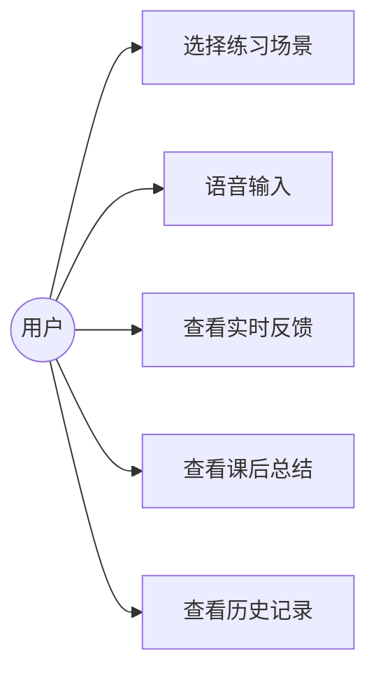
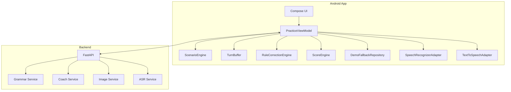
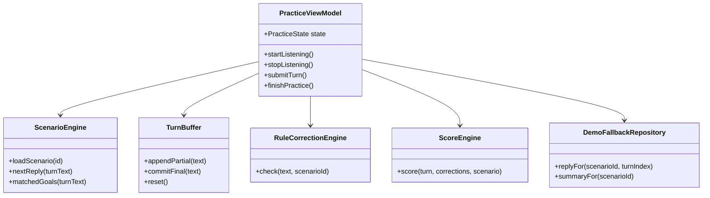
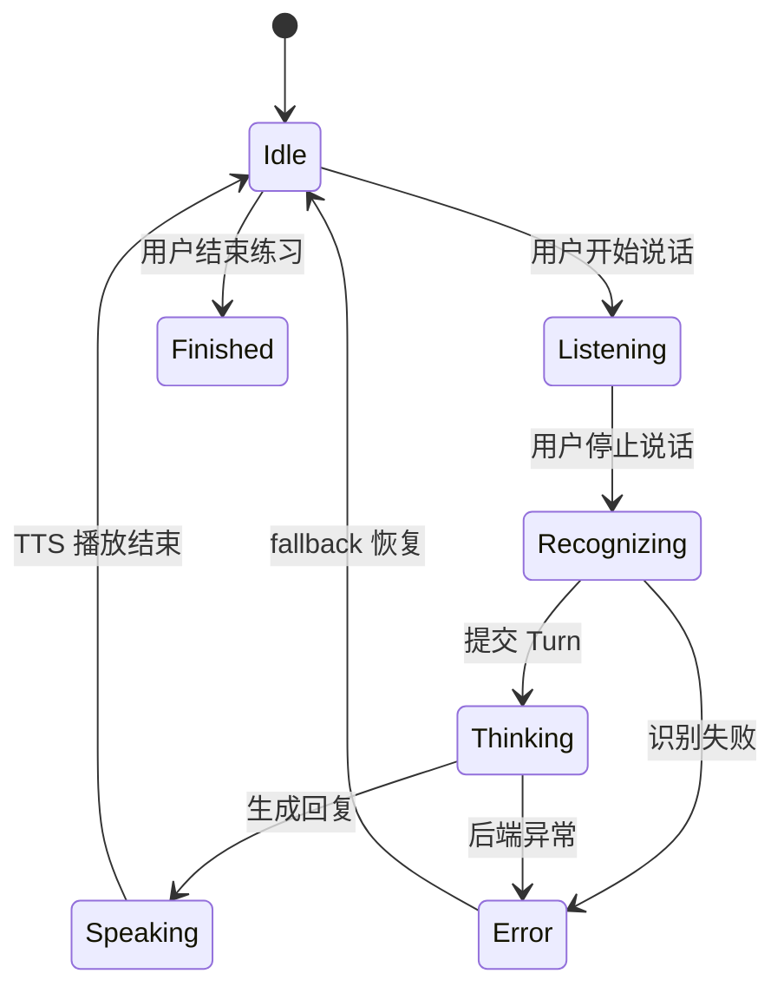

# UML 与流程图

## 用例图

```mermaid
flowchart LR
    User((用户))
    Select[选择练习场景]
    Speak[语音输入]
    Feedback[查看实时反馈]
    Summary[查看课后总结]
    History[查看历史记录]

    User --> Select
    User --> Speak
    User --> Feedback
    User --> Summary
    User --> History
```

## 组件图

```mermaid
flowchart TB
    subgraph Android App
        UI[Compose UI]
        VM[PracticeViewModel]
        Scenario[ScenarioEngine]
        Turn[TurnBuffer]
        Correction[RuleCorrectionEngine]
        Score[ScoreEngine]
        Fallback[DemoFallbackRepository]
        ASR[SpeechRecognizerAdapter]
        TTS[TextToSpeechAdapter]
    end

    subgraph Backend
        API[FastAPI]
        Grammar[Grammar Service]
        Coach[Coach Service]
        Image[Image Service]
        Paddle[ASR Service]
    end

    UI --> VM
    VM --> Scenario
    VM --> Turn
    VM --> Correction
    VM --> Score
    VM --> Fallback
    VM --> ASR
    VM --> TTS
    VM <--> API
    API --> Grammar
    API --> Coach
    API --> Image
    API --> Paddle
```

## 类图

```mermaid
classDiagram
    class PracticeViewModel {
        +PracticeState state
        +startListening()
        +stopListening()
        +submitTurn()
        +finishPractice()
    }

    class ScenarioEngine {
        +loadScenario(id)
        +nextReply(turnText)
        +matchedGoals(turnText)
    }

    class TurnBuffer {
        +appendPartial(text)
        +commitFinal(text)
        +reset()
    }

    class RuleCorrectionEngine {
        +check(text, scenarioId)
    }

    class ScoreEngine {
        +score(turn, corrections, scenario)
    }

    class DemoFallbackRepository {
        +replyFor(scenarioId, turnIndex)
        +summaryFor(scenarioId)
    }

    PracticeViewModel --> ScenarioEngine
    PracticeViewModel --> TurnBuffer
    PracticeViewModel --> RuleCorrectionEngine
    PracticeViewModel --> ScoreEngine
    PracticeViewModel --> DemoFallbackRepository
```

## 对话流程

```mermaid
stateDiagram-v2
    [*] --> Idle
    Idle --> Listening: 用户开始说话
    Listening --> Recognizing: 用户停止说话
    Recognizing --> Thinking: 提交 Turn
    Thinking --> Speaking: 生成回复
    Speaking --> Idle: TTS 播放结束
    Idle --> Finished: 用户结束练习
    Recognizing --> Error: 识别失败
    Thinking --> Error: 后端异常
    Error --> Idle: fallback 恢复
```

